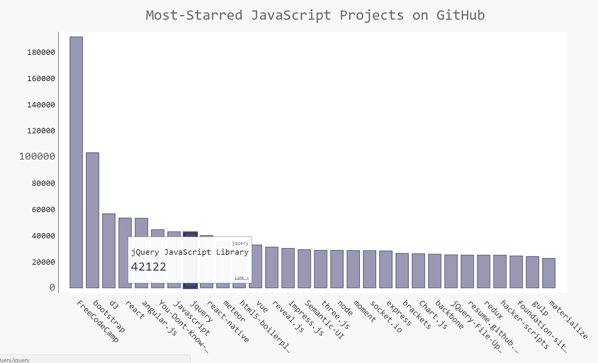

- [17-1: Other Languages](#other-languages)
- [17-2: Active Discussions](#active-discussions)
- [17-3: Testing *python_repos.py*](#testing-pythonrepos)

Back to [solutions](README.html).

17-1: Other Languages
---

Modify the API call in *python_repos.py* so it generates a chart showing the most popular projects in other languages. Try languages such as *JavaScript*, *Ruby*, *C*, *Java*, *Perl*, *Haskell*, and *Go*.

***Note:** The code for this exercise includes an [update](../chapter_17/README.html) that keeps a project with an empty description from breaking the program, and moves the font size settings to `my_style`.*

```python
import requests
import pygal
from pygal.style import LightColorizedStyle as LCS, LightenStyle as LS

# Make an API call, and store the response.
url = 'https://api.github.com/search/repositories?q=language:javascript&sort=stars'
r = requests.get(url)
print("Status code:", r.status_code)

# Store API response in a variable.
response_dict = r.json()
print("Total repositories:", response_dict['total_count'])

# Explore information about the repositories.
repo_dicts = response_dict['items']

names, plot_dicts = [], []
for repo_dict in repo_dicts:
    names.append(repo_dict['name'])

    # When a project is removed, it's still listed with stars.
    #   So it's in the top projects, but has no description. The description
    #   is None, which causes an exception when being used as a label.
    if repo_dict['description']:
        desc = repo_dict['description']
    else:
        desc = 'No description provided.'
    
    plot_dict = {
        'value': repo_dict['stargazers_count'],
        'label': desc,
        'xlink': repo_dict['html_url'],
        }
    plot_dicts.append(plot_dict)

# Make visualization.
my_style = LS('#333366', base_style=LCS)
my_style.title_font_size = 24
my_style.label_font_size = 14
my_style.major_label_font_size = 18

my_config = pygal.Config()
my_config.x_label_rotation = 45
my_config.show_legend = False
my_config.truncate_label = 15
my_config.show_y_guides = False
my_config.width = 1000

chart = pygal.Bar(my_config, style=my_style)
chart.title = 'Most-Starred JavaScript Projects on GitHub'
chart.x_labels = names

chart.add('', plot_dicts)
chart.render_to_file('js_repos.svg')
```

Output:



[top](#)